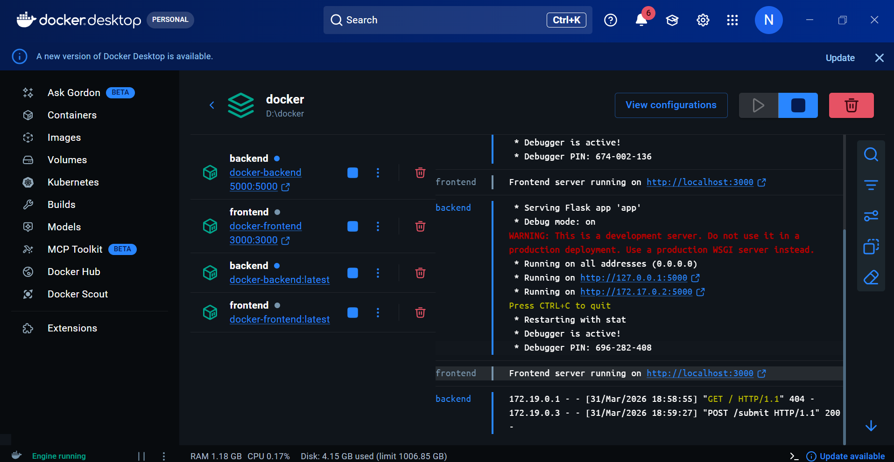
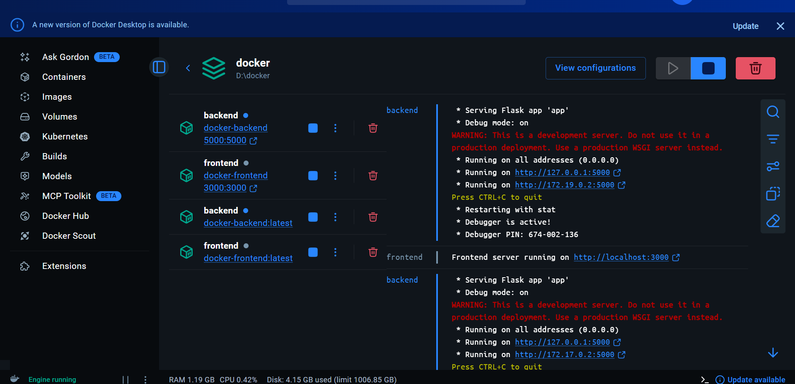

# Docker Assignment — Flask Backend + Express Frontend

A full-stack student registration application with a **Node.js/Express** frontend and a **Python/Flask** backend, fully containerized with **Docker**.

---

## 🗂️ Project Structure

```
docker/
├── backend/
│   ├── app.py              # Flask REST API
│   ├── requirements.txt    # Python dependencies
│   └── Dockerfile
├── frontend/
│   ├── server.js           # Express server
│   ├── package.json
│   ├── views/
│   │   ├── index.ejs       # Registration form
│   │   └── result.ejs      # Submission result page
│   ├── public/
│   │   └── style.css       # Dark-mode UI
│   └── Dockerfile
└── docker-compose.yml
```

---

## 🚀 Tech Stack

| Layer | Technology | Port |
|-------|------------|------|
| Frontend | Node.js + Express + EJS | `3000` |
| Backend | Python + Flask | `5000` |
| Container | Docker + Docker Compose | — |

---

## 🖼️ Docker Build Output

### Build Step 1 — Loading Dockerfiles & Pulling Base Images


### Build Step 2 — Images Built & Containers Created


---

## 📋 Form Fields

The student registration form includes the following fields (matching Flask Assignment 2):

| Field | Type | Description |
|-------|------|-------------|
| Full Name | Text | Student's full name |
| Student ID | Text | Unique student identifier |
| Email | Email | Student email address |
| Course | Dropdown | CS, Data Science, AI, etc. |
| Grade | Dropdown | A / B / C / D / F |

---

## ⚙️ How It Works

```
User (Browser)
     │
     ▼
Express Frontend :3000
     │  POST /submit  (axios)
     ▼
Flask Backend :5000
     │  validates + processes
     ▼
JSON response → result.ejs rendered
```

1. User opens `http://localhost:3000` → sees the registration form
2. On submit, Express POSTs data to `http://backend:5000/submit`
3. Flask validates fields, maps grade to status (A=Excellent, B=Good…)
4. Flask returns JSON → Express renders result page

---

## 🐳 Running with Docker

> **Prerequisites:** Docker Desktop must be running.

```bash
# Build and start both containers
docker compose up --build

# Stop containers
docker compose down
```

| URL | Description |
|-----|-------------|
| http://localhost:3000 | Student Registration Form |
| http://localhost:5000/health | Flask Health Check |

---

## 🔧 Port Conflict Fix

If you see `Bind for 0.0.0.0:5000 failed: port is already in use`:

```bash
# Find and free port 5000
netstat -ano | findstr :5000
# then: taskkill /PID <PID> /F
```

Then re-run `docker compose up --build`.

---

## 📦 Flask API Endpoints

| Method | Endpoint | Description |
|--------|----------|-------------|
| `GET` | `/health` | Health check → `{"status":"ok"}` |
| `POST` | `/submit` | Process student form data |

### Sample Request
```json
POST /submit
{
  "name": "John Doe",
  "student_id": "S12345",
  "email": "john@uni.edu",
  "course": "Computer Science",
  "grade": "A"
}
```

### Sample Response
```json
{
  "success": true,
  "message": "Student 'John Doe' submitted successfully!",
  "data": {
    "name": "John Doe",
    "student_id": "S12345",
    "email": "john@uni.edu",
    "course": "Computer Science",
    "grade": "A",
    "grade_status": "Excellent"
  }
}
```

---

## 👨‍💻 Author

Student Assignment — Docker with Flask & Node.js

---

## 🖼️ Docker Desktop Screenshots

### 1. Services Running in Docker Desktop


### 2. Live Logs & Submission Verification


